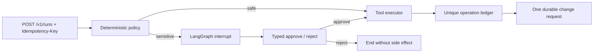

# LangGraph Resilient Agent

[](https://github.com/murillo-consulting/langgraph-resilient-agent/actions/workflows/ci.yml)

A durable LangGraph + FastAPI reference agent that treats **human approval**, **checkpoint recovery**, **idempotent side effects**, and **auditability** as application invariants.

It runs without an LLM key. A deterministic policy classifies two typed actions: inspection is safe; creating a change request pauses for human approval. The graph uses LangGraph's official SQLite checkpointer, while a separate business database owns run identity, the idempotency ledger, side effects, and append-only audit events.

## Execution model



LangGraph restarts the interrupted node when resuming. Therefore the effect lives in a later node and is protected by a stable `operation_id` plus a database uniqueness constraint. Audit events also have deterministic keys, so a restarted node cannot duplicate them.

## Guarantees covered by tests

- A sensitive action interrupts before its side effect.
- Approval resumes the same checkpointed thread; rejection never calls the tool.
- Retrying the same API request returns the same thread.
- Reusing an idempotency key with a different body returns `409`.
- A tool operation creates at most one durable business record.
- A different tenant or principal gets `404`, not graph state or audit data.
- Audit rows contain event types and hashes, not objectives, reasons, secrets, or tool payloads.
- Safe actions complete without human interruption.

> [!IMPORTANT]
> Header identity is a local adapter. Replace it with verified OIDC/JWT claims in production. SQLite is ideal for a single-instance demonstration; multi-instance deployment should use the official PostgreSQL checkpointer plus a transactional outbox for remote side effects.

## Run

Requirements: Python 3.12 and [uv](https://docs.astral.sh/uv/), or Docker.

```bash
uv sync --locked --all-groups
uv run uvicorn resilient_agent.app:app --reload
```

Start an approval-gated run:

```bash
curl -X POST http://localhost:8000/v1/runs \
  -H 'Content-Type: application/json' \
  -H 'X-Tenant-Id: acme' \
  -H 'X-Principal-Id: alice' \
  -H 'Idempotency-Key: demo-request-001' \
  -d '{"objective":"Prepare the database change","action":"create_change_request","resource":"database/payments"}'
```

Resume the returned `thread_id`:

```bash
curl -X POST http://localhost:8000/v1/runs/THREAD_ID/resume \
  -H 'Content-Type: application/json' \
  -H 'X-Tenant-Id: acme' \
  -H 'X-Principal-Id: alice' \
  -d '{"approved":true,"reason":"Reviewed by the on-call engineer"}'
```

Read state or the redacted audit stream:

```bash
curl -H 'X-Tenant-Id: acme' -H 'X-Principal-Id: alice' http://localhost:8000/v1/runs/THREAD_ID
curl -H 'X-Tenant-Id: acme' -H 'X-Principal-Id: alice' http://localhost:8000/v1/runs/THREAD_ID/audit
```

Docker:

```bash
docker compose up --build
```

## Verify

```bash
uv run ruff check .
uv run mypy src
uv run pytest
docker build -t langgraph-resilient-agent .
```

Dependencies are fully resolved in `uv.lock`; CI uses the same lock file and Python 3.12.

## Repository boundaries

- `graph.py` owns deterministic nodes, routing, interrupt semantics, and checkpointing.
- `service.py` owns thread lifecycle, ownership checks, and resume commands.
- `persistence.py` owns business transactions, deduplication, and redacted audit data.
- `app.py` is only the authenticated and validated HTTP adapter.

See [the primary-source research notes](docs/reference-research.md) for the production PostgreSQL design, replay risks, retention requirements, and official references. The implementation is original MIT-licensed code; no third-party example code was copied.

## License

MIT

## Architecture interactive

[Carte Archify et sources vérifiées](docs/architecture/README.md).
