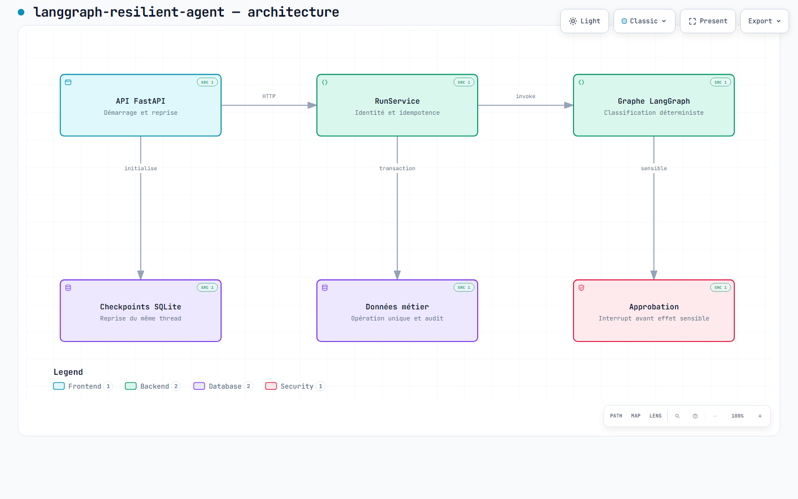

# Architecture de langgraph-resilient-agent

[Ouvrir le HTML autonome](architecture.html) · [Spécification Archify](architecture.archify.json)

Télécharger le HTML et l'ouvrir localement dans un navigateur : GitHub affiche son code et ne l'exécute pas. Aucun hébergement supplémentaire n'est nécessaire.

Vue compacte des composants du dépôt au commit `0dfc29c8c8f6a6ea02812a69ae9a63b8bd7b43f5`. Les flèches représentent les opérations indiquées, pas une preuve de déploiement ni un graphe exhaustif des appels. Les composants secondaires sans flèche complètent l'inventaire ; leurs liens détaillés restent dans les sources ci-dessous.

SQLite mono-instance et identité locale par en-têtes. Inspection sûre sans approbation ; refus sans effet. La base métier est distincte des checkpoints.

Le texte du diagramme est en français. Les commandes fixes du Viewer et l'attribut HTML `lang` restent en anglais, langue de repli d'Archify 2.17. Affichage statique initial, thèmes clair et sombre ; aucune animation activée.



## Sources vérifiées

| Composant | Source au commit de référence |
| --- | --- |
| API FastAPI | [src/resilient_agent/app.py:34–42](https://github.com/murillo-consulting/langgraph-resilient-agent/blob/0dfc29c8c8f6a6ea02812a69ae9a63b8bd7b43f5/src/resilient_agent/app.py#L34-L42) |
| RunService | [src/resilient_agent/service.py:16–24](https://github.com/murillo-consulting/langgraph-resilient-agent/blob/0dfc29c8c8f6a6ea02812a69ae9a63b8bd7b43f5/src/resilient_agent/service.py#L16-L24) |
| Graphe LangGraph | [src/resilient_agent/graph.py:16–24](https://github.com/murillo-consulting/langgraph-resilient-agent/blob/0dfc29c8c8f6a6ea02812a69ae9a63b8bd7b43f5/src/resilient_agent/graph.py#L16-L24) |
| Approbation | [src/resilient_agent/graph.py:41–49](https://github.com/murillo-consulting/langgraph-resilient-agent/blob/0dfc29c8c8f6a6ea02812a69ae9a63b8bd7b43f5/src/resilient_agent/graph.py#L41-L49) |
| Données métier | [src/resilient_agent/persistence.py:12–20](https://github.com/murillo-consulting/langgraph-resilient-agent/blob/0dfc29c8c8f6a6ea02812a69ae9a63b8bd7b43f5/src/resilient_agent/persistence.py#L12-L20) |
| Checkpoints SQLite | [src/resilient_agent/app.py:11–19](https://github.com/murillo-consulting/langgraph-resilient-agent/blob/0dfc29c8c8f6a6ea02812a69ae9a63b8bd7b43f5/src/resilient_agent/app.py#L11-L19) |

## Reproduction

Prérequis : Node.js et le skill [Archify](https://github.com/tt-a1i/archify), version 2.17 (MIT). Depuis la racine du dépôt, remplacer `<ARCHIFY>` par le répertoire du skill installé :

```text
rtk node <ARCHIFY>/bin/archify.mjs validate architecture docs/architecture/architecture.archify.json --repo-root . --quality showcase --json
rtk node <ARCHIFY>/bin/archify.mjs deliver architecture docs/architecture/architecture.archify.json docs/architecture/architecture.html --repo-root . --quality showcase --json
rtk node <ARCHIFY>/bin/archify.mjs visual-check docs/architecture/architecture.html --json
```

La révision source doit être présente dans le clone pour vérifier les références. Après une modification du JSON, relancer les trois commandes puis inspecter les captures des deux thèmes. Ne pas éditer le HTML généré.

## Vérifications et limites

Validation et livraison : **9/9 contrôles showcase**, zéro erreur et zéro avertissement. Le reçu portable `acceptance.json` lie les octets exacts aux contrôles et distingue la preuve navigateur de la revue des images.

Les tests applicatifs ne sont pas relancés : seuls le JSON, le HTML, les preuves documentaires et le lien du README changent. Cette documentation n'établit pas la santé d'un service, la sécurité d'une installation ni une conformité réglementaire.

Retour arrière : retirer le lien du README et les cinq fichiers de cette documentation, ou révoquer son commit. Aucun changement applicatif ou déploiement n'est associé.
